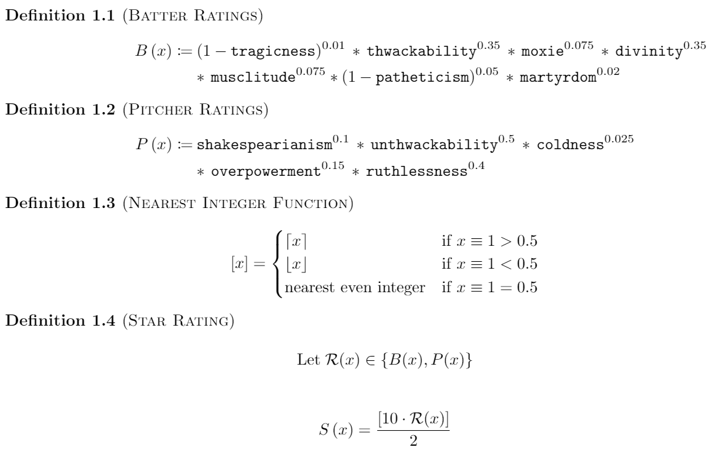

# SIBRFAQ
A list of Frequently Asked Questions for SIBR: the Society for Internet Blaseball Research

## What does SIBR do?

The Society peeks behind the curtain of Blaseball. We archive game data and work on projects to display and analyze that data. Often, as part of our work, we dive deeper into how Blaseball works and try to analyze what consequences our actions will have.

## How do I pronounce SIBR?

It's pronounced "SIBR"

## Okay, but what EXACTLY does SIBR do?

It's a complicated multi-step plan:
1) Harvest lots of raw data from games as they happen
2) Process that data and store it in a database
3) Calculate typical [reality-league](https://www.mlb.com/) statistics from that data, as well as new statistics unique to [ILB](https://blaseball.com/)
4) Build a [site](https://blaseball-reference.com/) where fans can view and explore these statistics
5) Use all of this data to publish [research](https://research.blaseball-reference.com/) into the underlying algorithms of Blaseball, and how its unique rules impact play

Currently #1 is basically complete, we have substantial progress on 2 and 3, 4 is under construction, and 5 is under way!

More detailed info is available about [the specific projects involved](./projects.md).

## What are the API endpoints?

https://www.postman.com/collections/8c0e97c7444de0a125ac

(Incomplete) documentation: https://github.com/Society-for-Internet-Blaseball-Research/blaseball-api-spec

## Is there a script to vote/bet/etc? Can you help me write one?

No and no. SIBR focuses on read-only data and unauthenticated endpoints, and we ask that others respect the Blaseball community and do the same.

However, we understand that itch. Our advice, if you must: build something for your own self development, but don't share it or brag about it. Most importantly:

> SO ABOUT THE PEANUTS 
> THE BOOK WAS STRIKE ONE 
> THE FRAUD IS STRIKE TWO 
> YOU WILL LEARN DISCIPLINE 
> GET YOUR PEANUTS 
> WHILE YOU STILL CAN

... don't commit the 🩸 Third Strike 🩸.

## Is anyone keeping track of game updates?

https://github.com/iliana/blaseball-archive-scripts

iliana is running this script locally, and we hope to have it productionized soon. Archives of game update logs can be found in the pinned messages of #archivism.

## Is there an API for historical data?

We're working on it. You can monitor the process in #archiving and #modeling.

## I'm new, what can I do to contribute?

It depends on which kind of genius you are.
If you're a coding genius, you can check the [Trello board](https://trello.com/b/KqiT4fms/society-for-internet-blaseball-research-projects), if you're more of a number cruncher, take a look at the [Grand List of Minor Mysteries](https://github.com/Society-for-Internet-Blaseball-Research/sibr-faq/blob/master/listery.md).

# ⚠️ FORBIDDEN KNOWLEDGE ZONE ⚠️

The Society (along with the Wiki) classify any information not visible on blaseball.com as "Forbidden Knowledge", to allow people playing Blaseball to decide whether they want to cross that threshold themselves.

When discussing Forbidden Knowledge, please use spoiler tags in the main Blaseball Discord (surround your text with double pipes `||`).

View Forbidden Knowledge

 
## What does each stat affect?

* Baserunning: baseThirst, continuation, groundFriction, indulgence, laserlikeness
* Defense: anticapitalism, chasiness, omniscience, tenaciousness, watchfulness
* Hitting: buoyancy, divinity, martyrdom, moxie, musclitude, patheticism, thwackability, tragicness
* Pitching: coldness, overpowerment, ruthlessness, shakesperianism, suppression, unthwackability, totalFingers
* Unclassifiable: cinnamon, deceased, fate, peanutAllergy, pressurization, soul

## How are star ratings determined?

